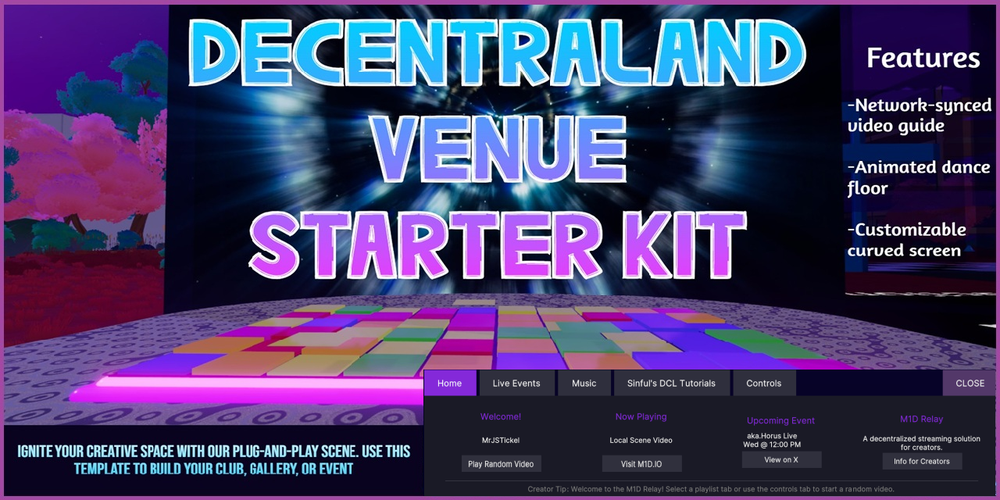

---

# 🎉 Decentraland Venue Starter Kit  
_The fastest way to launch your virtual club, gallery, or event space — powered by @m1d/dcl-components._

---

## 🧩 Features at a Glance

- **🎛 VideoGuide Component**  
  The scene’s “brain.” Connects to the shared M1D content network and syncs live playback across all visitors. Includes a sleek channel selector UI.

- **📺 Local Video Support**  
  Showcase your own video by adding a video URL to `index.ts`. A “Venue Content” button appears automatically in the UI for a seamless blend of global and local programming.

- **🌀 Custom Mesh Screen**  
  A high-performance, procedurally curved mesh screen for vibrant playback and excellent framerate — even under heavy scene load.

- **🪩 Animated Dance Floor**  
  Energize your venue with a custom shader-driven floor that cycles through pastel color palettes.

- **📐 Single Parcel Layout**  
  Neatly fits a 16×16m plot with optimized geometry and a polished, production-ready feel.

---

## ⚙️ Quick Start

Set up your venue in minutes:

```bash
# 1. Install dependencies
npm install

# 2. Launch locally
dcl start
```

🚀 You’ll be greeted with a working video screen, UI, and a glowing dance floor.

---

## 🧠 Core Logic (`src/index.ts`)

With the power of `@m1d/dcl-components`, you can launch a fully networked video experience in just two steps:

```ts
import { Vector3 } from '@dcl/sdk/math'
import { createCustomCurvedScreen, createVideoGuide } from '@m1d/dcl-components'

export async function main() {
    // =============================================================================
    // --- VIDEO SYSTEM SETUP ---
    // This is the core of the venue's media functionality.
    // =============================================================================

    // --- Initialize the M1D Relay ---
    // The local video is defined directly inside the function call for conciseness.
    const videoGuide = await createVideoGuide({
        localVideo: {
            src: 'https://demo.unified-streaming.com/k8s/features/stable/video/tears-of-steel/tears-of-steel.ism/.m3u8' // <<--Replace with your video URL or leave empty ''s for no local video button.
        }
    })

    // Create the physical screen that will display the video.
    // This uses the `createCurvedScreen` component from the library.
    createCurvedScreen({
        // --- How to Customize the Screen ---
        // position: The location of the screen in the scene. Vector3.create(X, Y, Z).
        // rotation: The orientation of the screen. Quaternion.fromEulerDegrees(X, Y, Z).
        // scale: The size of the screen. Vector3.create(X, Y, Z).
        position: Vector3.create(3.9, 0, 0),      // Centered in a 16x16 parcel
        rotation: Quaternion.fromEulerDegrees(0, 0, 0),
        scale: Vector3.create(.75, 1, 1),

        // This crucial line links the screen to the M1D Relay.
        // It tells the screen to display whatever video the guide is playing.
        videoTexture: videoGuide.videoTexture
    });

    // Load ground, floor, and other assets here...
}
```

---

## ✏️ Customization

Make the space your own:

- 🎬 **Add Your Video**  
  Edit `src/index.ts` and paste your HLS URL (`.m3u8`) into the `localVideo` object.

- 🧱 **Swap 3D Models**  
  Replace `models/ground1Parcel.glb` or `DF_WithSpinning_Shuffle_Float2.glb` with custom `.glb` assets.

- 🛠 **Reposition Objects**  
  Adjust `position`, `rotation`, and `scale` of elements directly in `index.ts`.

- 🧠 **Add Interactivity**  
  Extend `main()` with your logic, triggers, custom UI, or gameplay mechanics.

Your foundation is set. Now it’s time to create your world.

---

## 🤝 Support & Community

Made with ❤️ by M1D to elevate Decentraland creators.

Join us for support, sneak peeks, and creative inspiration:  
👉 **[M1D Discord](https://discord.gg/FnVxT8cVd2)**

---

**Build boldly. Dance freely. Create something unforgettable.**

---
